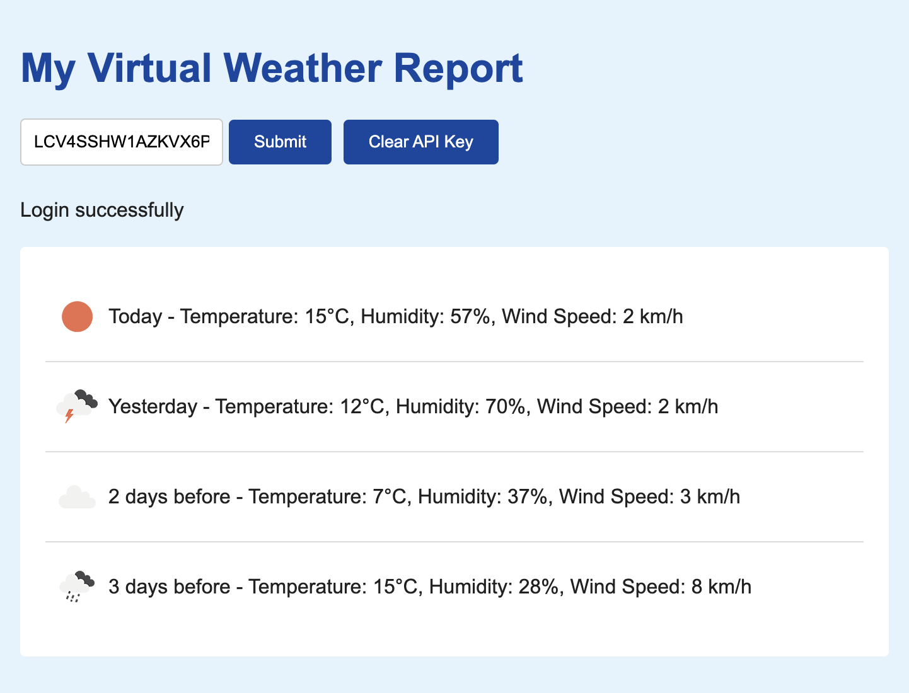

PA2577 – Assignment: Build Something

 

Name: Liao Yiqiang 
Student ID: 20010831-T051 
Email: yili22@student.bth.se 
Link to source code: 
<a href="https://github.com/l1006986533/Cloud_Computing_Big_Data_Assignment1">https://github.com/l1006986533/ Cloud_Computing_Big_Data_Assignment1</a>

## 1. Your software application idea
My application is a weather report that provides multi-day weather conditions with vitural data. It has a API authtication system, requiring users to have a valid API key to access the weather information. The key can be generated through a simple interface, which asks users to input their email address for authtication.

## 2. The architecture design decisions in your application
The application is built following a microservices architecture, which means to decompose the application into small, autonomous services, each implementing a specific business capability.
#### Authentication Service:
   - Handles user authentication and API key generation.
   - Verifies user credentials and provides secure access to the weather data.
#### Weather Report Service:
   - Responsible for collecting, storing, and serving weather data.
   - Offers endpoints to retrieve current and forecasted weather conditions.

## 3. The business implications of these architecture decisions
#### Scalability:
Microservices can be scaled independently, allowing for quick adjustments in response to varying loads. In my application, by simply change the *replicas* number of deployment script, Kubernetes can start more pods to handle the load.
#### Cost-Effectiveness
By scaling down during low traffic periods, it saves the resource costs.

 

## 4. Interaction between different microservices
#### API Key Verification
Before serving weather data, the Weather Report Service asks the Auth Service to verify the API key provided by the user. Once the API key is verified, the Weather Report Service fetches and serves the requested weather data.
#### Weather Data Delivery
When an authenticated user requests weather information, the Weather Report Service processes this request and  send the weather data to user's web interface.

## 5. Details of your deployment
In my deployment, I divide my application into three parts: backend system built with Flask, a MySQL database, and a frontend interface for user interactions.
### 5.1 Backend System:
The backend is a Flask application that interfaces with a MySQL database, which stores weather data and API keys associated with user emails. To deploy it, I create a Docker image based on the official Python image and add my code to it. I also set my MySQL root password as an environment variable and store it in Kubernetes secrets, along with other sensitive information. By doing so, I avoid hard-coded data leaks and security vulnerabilities. Lastly, I expose port 5000 by creating the backend-service.
### 5.2 MySQL database
I use a StatefulSet for MySQL with 2 replicas and create a LoadBalancer type service to ensure efficient load distribution across instances, allowing for seamless scaling to handle increased data flow. Additionally, I create a persistent volume claim to ensure data persistence, which can prevent data loss and maintains data availability when pods are replaced or relocated.
### 5.3 Frontend
Because all my frontend web pages are static content, I use Nginx image as my frontend server. I copied my files into default Nginx assets folder, and deployed 2 replicas using Kubernetes. I also use a LoadBalancer service to expose the port and balance the load.
## 6. Security issues identified and/or mitigated
### 6.1 Kubernetes Secrets
In my application it has sensitive data like MySQL password, by storing them as secrets it reduces the risk of sensitive data leaking. Besides, it simplifies the management of sensitive data. For example, if the MySQL password needs to be rotated or changed, updating the secret will broadcast the change to all pods using that secret, which makes it easy to maintain and update credentials without redeploying the entire application.

### 6.2 API Keys
API keys are a simple yet effective way to control access in my application. They allow you to identify and authenticate requests, ensuring that only authorized users can access my services. In the future I can also implement rate limiting and monitor usage patterns by tracking the API is called by whom. 